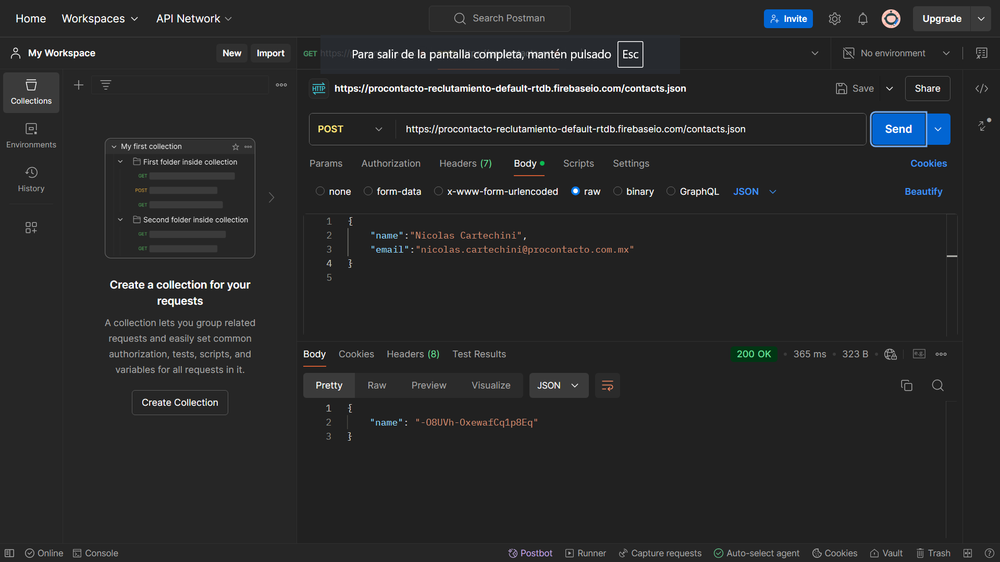
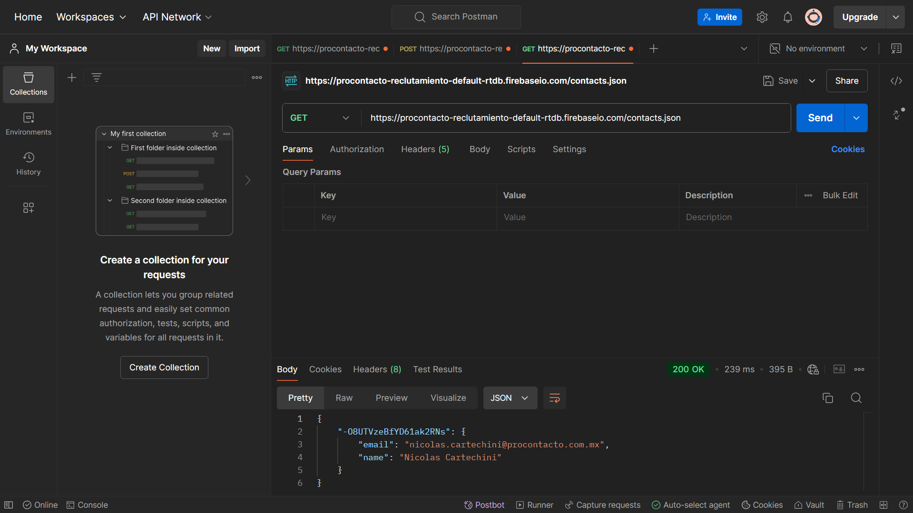

## Ejercicio 3

### Punto (1)

### Punto (2)

### Punto (3)

### ¿Qué diferencias se observan entre las llamadas el punto 1 y 3?

La diferencia que se encuentra en el punto 1 es que luego de hacer la primera request GET, resivimos una lista con los datos de contactos ya guardados anteriormente. En el punto numero 3, volvemos a hacer una llamada a la request Get pero previamente realizamos una Request POST en la que cargamos nuestros datos en la lista, por lo tanto, en la 2da request GET nos aparece la misma lista pero con nuestros datos agregados al final de la misma.
