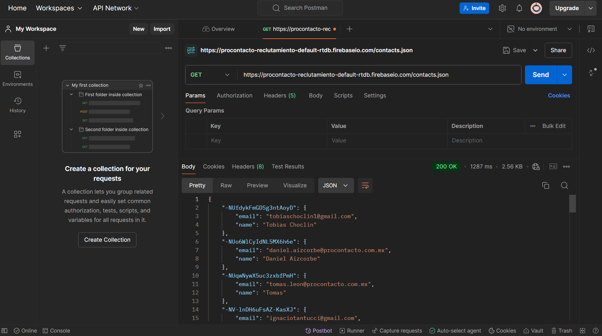
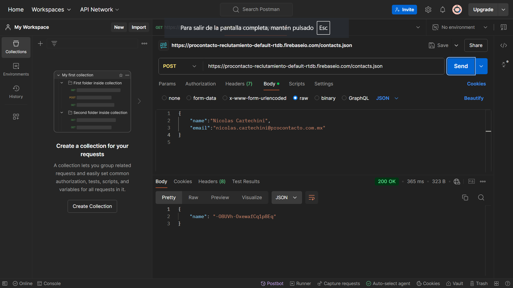
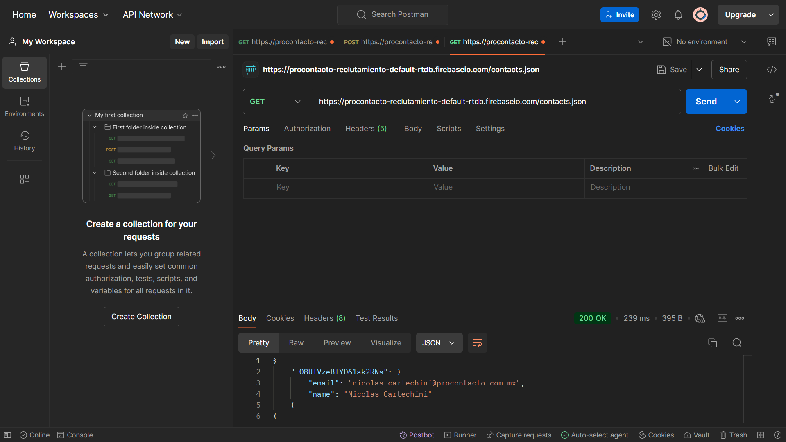

# Actividad Evaluatoria Procontacto

## Ejercicio 2

### (1) ¿Qué es un servidor HTTP?

Un servidor HTTP es un software o hardware. Su función es almacenar, procesar y entregar contenido web a los navegadores de los usuarios a través del protocolo HTTP (Hypertext Transfer Protocol). Cuando los usuarios ingresan una URL en sus navegadores, estos le envían una solicitud al servidor HTTP correspondiente. El servidor, a su vez, responde con los recursos solicitados, como páginas HTML, imágenes, videos, etc.

### (2)	¿Qué son los verbos HTTP? Mencionar los más conocidos

Los verbos HTTP son comandos que indican la acción que el usuario desea realizar en el servidor.
Los verbos más conocidos son: Get, Post, Put, Delete, Patch, Head y Options.

### (3)	¿Qué es un request y un response en una comunicación HTTP? ¿Qué son los headers?

Un request es un mensaje enviado por el cliente al servidor que indica qué acción desea realizar. Una response es el mensaje que el servidor envía de vuelta al cliente en respuesta a su solicitud. Los headers son líneas de información que se envían junto con una request y una response. Proporcionan metadatos sobre la solicitud o respuesta.

### (4)	¿Qué es un queryString? (En el contexto de una url)

Un query string (cadena de consulta) es una parte de una URL que se utiliza para enviar datos adicionales al servidor. Generalmente, se encuentra al final de la URL, después de un signo de interrogación (?).

### (5)	¿Qué es el responseCode? ¿Qué significado tiene los posibles valores devueltos?

El responseCode es un número de tres dígitos que el servidor envía al cliente como parte de la respuesta HTTP. Este código indica el resultado de la solicitud realizada y ayuda al cliente a entender si la acción fue exitosa o si hubo algún problema. Cada valor devuelto tiene un significado especifico:

•	1xx – Informativos

•	2xx – Éxito

•	3xx – Redirección

•	4xx - Error del Cliente

•	5xx - Error del Servidor

### (6)	¿Cómo se envía la data en un Get y cómo en un POST? 

En el Get los datos se envían en la URL, son visibles, y hay limitaciones en la longitud. En un POST los datos se envían en el cuerpo de la solicitud, no son visibles en la URL, y permiten enviar más información de manera segura.

### (7)	¿Qué verbo http utiliza el navegador cuando accedemos a una página?

Cuando accedemos a una página el verbo HTTP que se utiliza es GET.

### (8)	Explicar brevemente qué son las estructuras de datos JSON y XML dando ejemplo de estructuras posibles.

JSON es un formato ligero de intercambio de datos que es fácil de leer y escribir para los humanos, y fácil de analizar y generar para las máquinas. Es comúnmente utilizado en aplicaciones web para enviar datos entre el cliente y el servidor. Por ejemplo:

{
  "nombre": "Nicolás",
  "edad": 26,
  "ciudad": "Buenos Aires",
  "intereses": ["deportes", "música", "películas"],
  "direccion": {
    "calle": "Buen Viaje",
    "numero": 243
  },
  "contacto": [
    {
      "tipo": "email",
      "valor": "nicolas@example.com"
    },
    {
      "tipo": "teléfono",
      "valor": "+54 11 1234 5678"
    }
  ]
}

XML es un lenguaje de marcado que define un conjunto de reglas para la codificación de documentos en un formato que es tanto legible por humanos como legible por máquinas. A diferencia de JSON, XML utiliza etiquetas para definir la estructura de los datos. Por Ejemplo:

<persona>
  <nombre>Nicolás</nombre>
  <edad>26</edad>
  <ciudad>Buenos Aires</ciudad>
  <intereses>
    <interes>deportes</interes>
    <interes>música</interes>
    <interes>películas</interes>
  </intereses>
  <direccion>
    <calle>Buen Viaje</calle>
    <numero>243</numero>
  </direccion>
  <contacto>
    <item>
      <tipo>email</tipo>
      <valor>nicolas@example.com</valor>
    </item>
    <item>
      <tipo>teléfono</tipo>
      <valor>+54 11 1234 5678</valor>
    </item>
  </contacto>
</persona>

### (9)	Explicar brevemente el estándar SOAP

SOAP es un protocolo de comunicación que permite el intercambio de información estructurada en la implementación de servicios web. Utiliza XML como formato de mensajería y se basa en estándares abiertos, lo que facilita la interoperabilidad entre diferentes plataformas y lenguajes de programación.

### (10) Explicar brevemente el estándar REST Full

RESTfull es un estilo arquitectónico para el diseño de servicios web que se basa en un conjunto de principios y restricciones que permiten la comunicación entre sistemas. REST utiliza los métodos HTTP y se centra en la manipulación de recursos a través de sus representaciones.

### (11)	¿Qué son los headers en un request? ¿Para qué se utiliza el key Content-type en un header?

Los headers en un request HTTP son componentes clave que proporcionan información adicional sobre la solicitud que se está enviando al servidor. Estos encabezados pueden incluir detalles sobre el cliente, la naturaleza de los datos enviados, la autenticación, las preferencias de caché y mucho más. 

## Ejercicio 3

### Punto (1)

### Punto (2)

### Punto (3)

### ¿Qué diferencias se observan entre las llamadas el punto 1 y 3?

La diferencia que se encuentra en el punto 1 es que luego de hacer la primera request GET, resivimos una lista con los datos de contactos ya guardados anteriormente. En el punto numero 3, volvemos a hacer una llamada a la request Get pero previamente realizamos una Request POST en la que cargamos nuestros datos en la lista, por lo tanto, en la 2da request GET nos aparece la misma lista pero con nuestros datos agregados al final de la misma.

## Ejercicio 4

Mi perfil publico de Trailhead [here](https://www.salesforce.com/trailblazer/ghicjn7mpczlybwrp0).

## Ejercicio 5

### 1 -	Lead

Un lead es una persona o entidad que ha mostrado interés en los productos o servicios de una empresa.
Datos estándar: First Name, Last Name, Company ,Email, Phone, Status y Rating. Puede convertirse en una cuenta o contacto, y puede tener oportunidades asociadas.

### 2 - Account

Una cuenta representa a una empresa o una entidad con la que tienes una relación comercial. Datos estándar: Account Name, Type, Industry, Annual Revenue, Phone y Website. Tiene muchos contactos y oportunidades. Puede tener activos (Assets) y casos (Cases) asociados.

### 3 - Contact

Un contacto es una persona asociada con una cuenta. Datos estándar: First Name, Last Name, Email, Phone y Account Name. Pertenece a una cuenta y puede estar asociado a oportunidades y casos.

### 4 - Opportunity

Una oportunidad es un potencial negocio en el que se está trabajando. Datos estándar: Opportunity Name, Account Name, Stage, Close Date y Amount. Se asocia a una cuenta, puede tener varios productos (Products) y ser parte de un presupuesto (Quote).

### 5 - Product

Un producto es un artículo que se vende o se ofrece en una oportunidad. Datos estándar: Product Name, Product Code, Description y Family. Se relaciona con precios en una lista de precios (PriceBook) y se puede incluir en presupuestos (Quote).

### 6 - PriceBook

Un PriceBook es una lista de precios para productos y servicios. Datos estándar: Name, Description y Is Active. Puede contener múltiples productos y se asocia a oportunidades y presupuestos. 

### 7 - Quote

Un presupuesto es una oferta formal de productos y servicios. Datos estándar: Quote Name, Opportunity, Account y Status. Se relaciona con una oportunidad y puede contener productos y precios.

### 8 - Asset

Un activo es un artículo vendido a un cliente que se puede rastrear a través del ciclo de vida. Datos estándar: Asset Name, Serial Number, Account y Product.
Está asociado a una cuenta y a productos.

### 9 - Case

Un caso es un problema o solicitud de un cliente que necesita atención. Datos estándar: Case Number, Subject, Status, Priority y Account. Se puede asociar a una cuenta y un contacto.

### 10 - Article

Un artículo es un documento o contenido que se puede utilizar para ayudar a resolver un caso. Datos estándar: Title, Summary, Body y Article Number.

## Ejercicio 6

## Soluciones de SalesForce

### A - ¿Qué es Salesforce?

Salesforce es más que un simple CRM. Aunque almacena datos de clientes, gestiona prospectos y facilita la colaboración, viene con numerosas funciones estándar y personalizables listas para usar, que permiten gestionar ventas, atención al cliente, marketing, y análisis sin necesidad de configuraciones complejas. 

### B - ¿Qué es Sales Cloud?

Sales Cloud es uno de los productos principales de Salesforce diseñado específicamente para gestionar el proceso de ventas y optimizar las actividades relacionadas con la gestión de clientes potenciales, oportunidades y cuentas. Se trata de una solución de CRM (Customer Relationship Management) que ayuda a las empresas a gestionar su relación con los clientes y a cerrar ventas de manera más eficiente.

### C - ¿Qué es Service Cloud?

Service Cloud es un producto de Salesforce diseñado específicamente para ayudar a las empresas a gestionar sus servicios de atención al cliente de manera más eficiente. Esta centrado en mejorar la experiencia del cliente al proporcionar herramientas para resolver problemas rápidamente, automatizar procesos de soporte y ofrecer servicios personalizados en múltiples canales de comunicación.

### D - ¿Qué es Health Cloud?

Health Cloud es un producto de Salesforce diseñado específicamente para la industria del cuidado de la salud. Esta enfocado en mejorar la interacción y gestión de los pacientes, profesionales médicos, aseguradoras y otros actores dentro del ecosistema de atención sanitaria. Health Cloud permite a las organizaciones de salud ofrecer un servicio más personalizado y centrado en el paciente, facilitando la gestión de historias clínicas, la coordinación del cuidado y la mejora en la relación con los pacientes.

### E - ¿Qué es Marketing Cloud?

Marketing Cloud es una plataforma de Salesforce diseñada para gestionar y optimizar las actividades de marketing digital, ayudando a las empresas a crear campañas personalizadas, interactuar con sus audiencias y gestionar la relación con los clientes en tiempo real.

## Funcionalidades de Salesforce

### A - ¿Qué es un RecordType?

Un RecordType es una funcionalidad que permite personalizar la forma en que se manejan y visualizan los registros de un objeto específico, como Accounts, Opportunities, Leads, etc.

### B - ¿Qué es un ReportType?

Un Report Type es una plantilla que define la estructura y los datos que se pueden incluir en un informe.

### C - ¿Qué es un Page Layout?

Un Page Layout es una configuración que determina cómo se presenta la información de un registro dentro de la interfaz de usuario.

### D - ¿Qué es un Compact Layout?

Un Compact Layout en es una configuración que permite mostrar un resumen conciso de la información más importante de un registro en la interfaz de usuario, especialmente en vistas de lista, vistas previas y cuando se visualizan registros en dispositivos móviles.

### E - ¿Qué es un Perfil?

Un Perfil es un conjunto de configuraciones y permisos que determinan lo que un usuario puede ver y hacer dentro de la plataforma. Los perfiles son fundamentales para gestionar la seguridad y el acceso a los datos, así como para personalizar la experiencia del usuario según sus roles y responsabilidades dentro de la organización.

### F - ¿Qué es un Rol?

Un Rol en Salesforce es una configuración que determina la jerarquía de los usuarios dentro de la organización y establece la visibilidad de los registros y datos entre diferentes usuarios. Los Roles controlan qué datos pueden ver en función de su posición en la jerarquía organizacional.

### G - ¿Qué es un Validation Rule?

Una Validation Rule es una regla que se utiliza para garantizar que los datos ingresados en un registro cumplan con ciertos criterios antes de que se pueda guardar el registro. Estas reglas ayudan a mantener la integridad de los datos y aseguran que los usuarios ingresen información válida y coherente.

### H - ¿Qué diferencia hay entre una relación Master Detail y Lookup?

Las relaciones Master-Detail y Lookup son dos tipos de relaciones que se pueden establecer entre objetos. Ambas permiten la conexión de registros entre diferentes objetos, pero tienen características y comportamientos distintos. La elección entre una relación Master-Detail y una relación Lookup depende de la naturaleza de la relación que deseas establecer entre los objetos y cómo deseas gestionar la integridad de los datos y la seguridad. Las relaciones Master-Detail son más rígidas y estructuradas, mientras que las relaciones Lookup son más flexibles y permiten una gestión de datos más suelta.

### I - ¿Qué es un Sandbox?

Un Sandbox es un entorno de prueba y desarrollo separado de la organización principal (producción) que permite a los administradores y desarrolladores realizar pruebas, desarrollos y personalizaciones sin afectar los datos y configuraciones en el entorno de producción.

### J - ¿Qué es un ChangeSet?

Un Change Set es una herramienta que permite a los administradores y desarrolladores empaquetar y mover cambios de configuración y metadatos desde una organización Salesforce a otra.

### K - ¿Para qué sirve el import Wizard de Salesforce?

El Data Import Wizard es una herramienta que permite a los usuarios importar datos a su organización de Salesforce de manera sencilla y eficiente. Esta herramienta es especialmente útil para cargar registros en objetos estándar y personalizados sin necesidad de conocimientos técnicos avanzados.

### L - ¿Para qué sirve la funcionalidad Web to Lead?

La funcionalidad Web to Lead es una herramienta que permite capturar información de clientes potenciales (leads) directamente desde un sitio web y enviarla automáticamente a Salesforce como nuevos registros de leads.

### M - ¿Para qué sirve la funcionalidad Web to Case?

La funcionalidad Web to Case permite a las empresas recibir y gestionar solicitudes de soporte y casos directamente desde su sitio web. Al igual que la funcionalidad Web to Lead, esta herramienta captura información de los clientes a través de un formulario en línea y crea automáticamente un registro de caso en Salesforce. Esto facilita la gestión de solicitudes de servicio al cliente de manera organizada y eficiente.

### N - ¿Para qué sirve la funcionalidad Omnichannel?

La funcionalidad Omnichannel es una herramienta diseñada para mejorar la experiencia del cliente y optimizar la gestión del servicio al cliente al permitir que las empresas ofrezcan soporte a través de múltiples canales de comunicación. Esta funcionalidad permite a los agentes de servicio al cliente interactuar con los clientes a través de diferentes plataformas, como chat, correo electrónico, teléfono y redes sociales, desde un único lugar.

### O - ¿Para qué sirve la funcionalidad Chatter?

Chatter es una herramienta de colaboración en tiempo real integrada en Salesforce que permite a los usuarios comunicarse y colaborar de manera más efectiva dentro de la plataforma. Está diseñada para facilitar la interacción entre empleados, equipos y departamentos, mejorando la productividad y la comunicación en la organización.

## Conceptos Generales

### A - ¿Qué significa SaaS?

SaaS, que significa Software as a Service, es un modelo de distribución de software en el que las aplicaciones se hospedan en la nube y se ofrecen a los usuarios a través de Internet.

### B - ¿Salesforce es Saas?

Sí, Salesforce es un ejemplo de SaaS ya que es una plataforma basada en la nube que permite a las empresas acceder a sus aplicaciones de gestión de relaciones con clientes y otras herramientas relacionadas sin necesidad de instalar software en sus propios servidores o dispositivos.

### C - ¿Qué significa que una solución sea Cloud?

Cuando se dice que una solución es Cloud, se refiere a que los servicios, recursos o aplicaciones se alojan en servidores remotos accesibles a través de Internet, en lugar de estar instalados localmente en dispositivos individuales o servidores físicos de una organización.

### D - ¿Qué significa que una solución sea On-Premise?

Una solución On-Premise se refiere a un modelo de implementación de software o servicios en el que las aplicaciones, datos y recursos informáticos se instalan y se gestionan localmente en los servidores y dispositivos de una organización, en lugar de ser alojados en la nube.

### E - ¿Qué es un pipeline de ventas?

Un pipeline de ventas es un visualizador del proceso de ventas que muestra las etapas que un prospecto o cliente potencial atraviesa desde el primer contacto hasta el cierre de una venta.

### F - ¿Qué es un funnel de ventas?

Un funnel de ventas es un modelo que ilustra el proceso que atraviesan los clientes potenciales desde el primer contacto con una marca hasta la conversión final en clientes.

### G - ¿Qué significa Customer Experience?

Customer Experience se refiere a la experiencia total que un cliente tiene con una marca o empresa a lo largo de todas las interacciones que tiene con ella.

### H - ¿Qué significa omnicanalidad?

La omnicanalidad se refiere a una estrategia de marketing y ventas que proporciona a los clientes una experiencia integrada y coherente a través de múltiples canales y puntos de contacto. Esta estrategia busca asegurar que los clientes puedan interactuar con una marca de manera fluida, sin importar el canal que elijan, ya sea en línea o fuera de línea.

### I - ¿Qué significa que un negocio sea B2B?¿Qué significa que un negocio sea B2C?¿Qué es un KPI?

El término B2B se refiere a un modelo de negocio donde las transacciones y relaciones comerciales se realizan entre empresas. En este modelo, una empresa vende productos o servicios a otra empresa en lugar de a consumidores individuales.
El término B2C se refiere a un modelo de negocio donde las transacciones y relaciones comerciales se realizan directamente entre una empresa y consumidores individuales. En este modelo, una empresa vende productos o servicios directamente al público.
Un KPI es una métrica utilizada por las empresas para evaluar su éxito en alcanzar objetivos específicos.

### J - ¿Qué es una API y en qué se diferencia de una Rest API?

Una API es a interfaz de programación de aplicaciones que permite que varios elementos de software se conecten entre sí e intercambien información. Una Rest API es un tipo de API pero su diferencia es que sigue los principios de REST (Representational State Transfer), un estilo arquitectónico utilizado en el diseño de sistemas distribuidos. Las Rest APIs son especialmente comunes en aplicaciones web y servicios en la nube debido a su simplicidad y eficiencia.

### K - ¿Qué es un Proceso Batch?

Un proceso batch es un método de procesamiento de datos en el que un conjunto de transacciones o tareas se agrupan y se procesan de manera conjunta en lugar de ser procesadas de forma individual y en tiempo real. Este enfoque es común en sistemas de informática y en aplicaciones empresariales donde se requiere procesar grandes volúmenes de datos de manera eficiente.

### L - ¿Qué es Kanban?

Kanban es un método ágil de gestión de proyectos y trabajo que se originó en la industria manufacturera, específicamente en Toyota, para optimizar la producción y mejorar la eficiencia. El término "kanban" se traduce del japonés como "tarjeta visual" o "señal visual". Este enfoque se centra en visualizar el flujo de trabajo y gestionar el trabajo en progreso, lo que ayuda a equipos y organizaciones a mejorar su productividad y efectividad.

### M - ¿Qué es un ERP? 

Un ERP es un sistema de software integrado que ayuda a las organizaciones a gestionar y automatizar una amplia gama de procesos de negocio y funciones dentro de una empresa. Los sistemas ERP permiten la recopilación, almacenamiento y análisis de datos de diversas áreas de la empresa, facilitando una visión completa y en tiempo real de las operaciones comerciales.

### N - ¿Salesforce es un ERP?

Salesforce no es un ERP, pero es una plataforma de gestión de relaciones con los clientes que ofrece una serie de características y funcionalidades que pueden complementar y, en algunos casos, sustituir ciertas capacidades de un ERP.